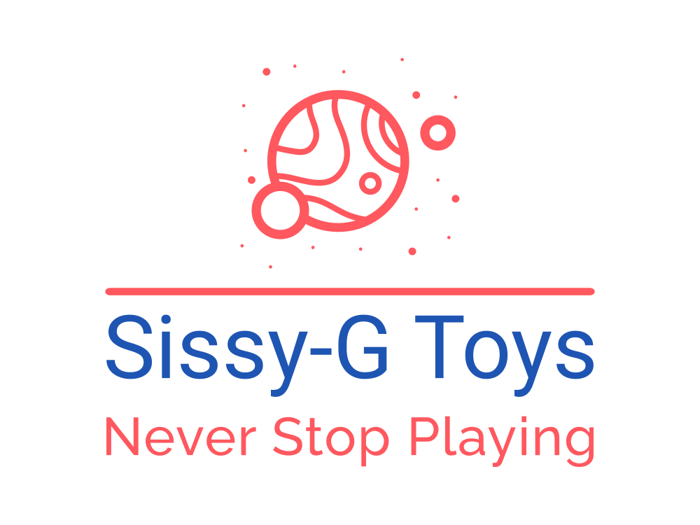
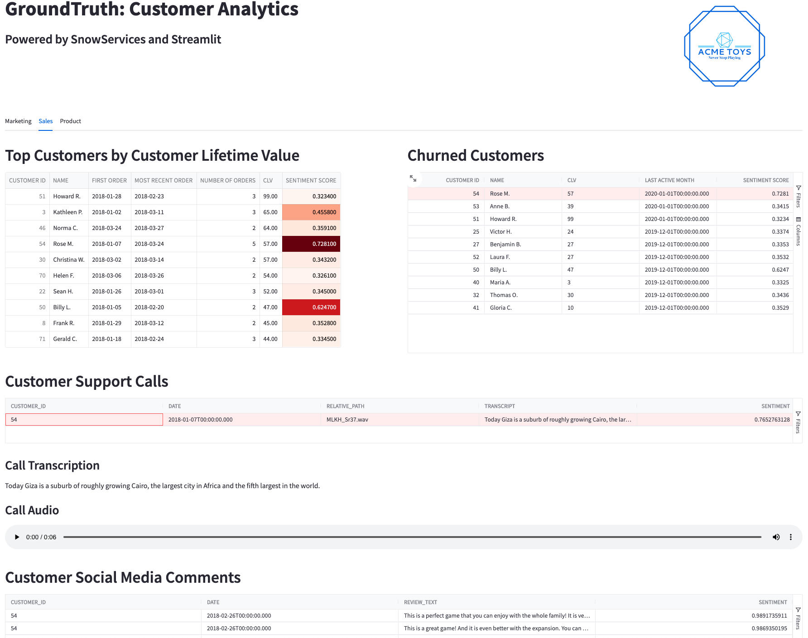

  
<sub><sup>Sissy-G ~= [Syzygy](https://en.wikipedia.org/wiki/Syzygy) /ˈsɪzɪdʒi/ ASTRONOMY the alignment of three or more celestial bodies.</sup></sub>


Overview
========
This demonstration shows an Airflow integration with Weaviate and OpenAI.  Sissy-G Toys is an online retailer for toys and games.  The GroundTruth customer analytics application provides marketing, sales and product managers with a one-stop-shop for analytics.  
  
  
  

This workflow includes:
- sourcing structured, unstructured and semistructured data from different systems
- ingest with Astronomer's [python SDK for Airflow](https://github.com/astronomer/astro-sdk)
- data quality checks with [Great Expectations](https://greatexpectations.io/)
- transformations and tests in [DBT](https://www.getdbt.com/), 
- audio file transcription with [OpenAI Whisper](https://github.com/openai/whisper)
- natural language embeddings with [OpenAI Embeddings](https://platform.openai.com/docs/guides/embeddings)
- vector search and named-entity recognition with [Weaviate](https://weaviate.io/)
- sentiment classification with [Keras](https://keras.io/)  
  
All of the above are presented in a [Streamlit](http://www.streamlit.io) applicaiton.  
  


  

Project Contents
================

Your Astro project contains the following files and folders:

- dags: This folder contains the Python files for the Airflow DAG. 
- Dockerfile: This file contains a versioned Astro Runtime Docker image that provides a differentiated Airflow experience. If you want to execute other commands or overrides at runtime, specify them here.
- include: This folder contains additional directories for the services that will be built in the demo. Services included in this demo include:
    - [minio](https://min.io/): Object storage which is used for ingest staging as well as stateful backups for other services.  
    - [mlflow](https://mlflow.org/): A platform for the machine learning lifecycle including model registry and experiment tracking.
    - [weaviate](https://weaviate.io/): A vector database 
    - [streamlit](http://www.streamlit.io): A web application framework for building data-centric apps.

- packages.txt: Install OS-level packages needed for the project.
- requirements.txt: Install Python packages needed for the project.
- plugins: Add custom or community plugins for your project to this file. It is empty by default.
- airflow_settings.yaml: Use this local-only file to specify Airflow Connections, Variables, and Pools instead of entering them in the Airflow UI as you develop DAGs in this project.

Deploy Your Project Locally
===========================

Prerequisites:
Docker Desktop or similar Docker services running locally.  
OpenAI account or [Trial Account](https://platform.openai.com/signup)
  
1. Install [Astronomver CLI](https://github.com/astronomer/astro-cli).  The Astro CLI is a command-line interface for data orchestration. It allows you to get started with Apache Airflow quickly and it can be used with all Astronomer products. This will provide a local instance of Airflow if you don't have an existing service.
For MacOS  
```bash
brew install astro
```
  
For Linux
```bash
curl -sSL install.astronomer.io | sudo bash -s
```

2. Clone this repository.  
```bash
git clone https://github.com/astronomer/airflow-ml-demo
cd airflow-ml-demo
```
Edit the `.env` file and update the "OPENAI_APIKEY" parameter with your OpenAI token.
  
3.  Start an Airflow instance..  
```bash
astro dev start
```
  
4. Run the Airflow DAG in the Airflow UI 
- Open [localhost:8080](http://localhost:8080) in a browser and login (username: `admin`, password: `admin`)
- Click the "Play" button for customer_analytics and select "Trigger DAG".

      
5. Open the streamlit application [http://localhost:8501](http://localhost:8501)
Other service UIs are available at the the following:
- Airflow: [http://localhost:8080](http://localhost:8080) Username:Password is admin:admin
- Minio: [http://localhost:9000](http://localhost:9000) Username:Password is minioadmin:minioadmin
- MLFlow: [http://localhost:5000](http://localhost:5000)
- Weaviate: [https://link.weaviate.io/3UD9H8z](https://console.weaviate.io/) Enter localhost:8081 in the "Self-hosted Weaviate" field.